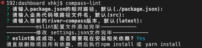

# river-compass

一个包含 prettier，eslint，stylelint 的配置文件合集


# Use

安装

```bash
npm i river-compass
```

in `.eslintrc.js`

```js
module.exports = {
  extends: [require.resolve('river-compass/dist/eslint')],

  // in antd-design-pro
  globals: {
    ANT_DESIGN_PRO_ONLY_DO_NOT_USE_IN_YOUR_PRODUCTION: true,
    page: true,
  },

  rules: {
    // your rules
  },
};
```

in `.stylelintrc.js`

```js
module.exports = {
  extends: [require.resolve('river-compass/dist/stylelint')],
  rules: {
    // your rules
  },
};
```

in `.prettierrc.js`

```js
const rclint = require('river-compass');

module.exports = {
  ...rclint.prettier,
};
```

# bin
为了给项目集成lint更加方便，也为了解决eslint相关包冲突失效的问题。
提供了image.png命令，一键集成lint，以及vscode的setting.json。
npm install river-compass -g
项目根目录下执行：
```s
compass-lint
```
